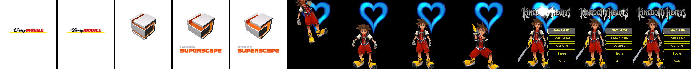
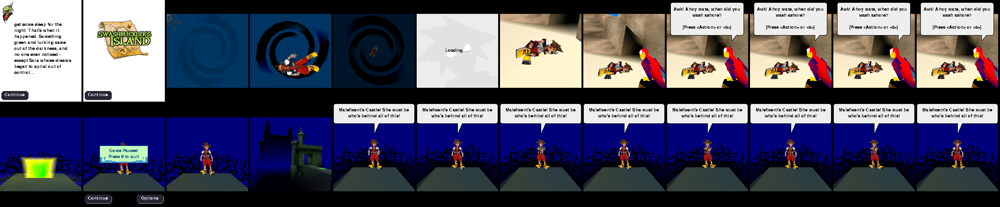
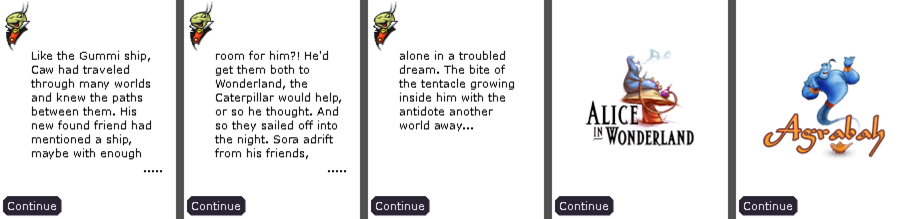
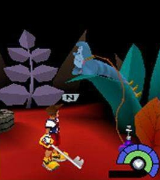
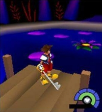
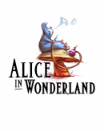
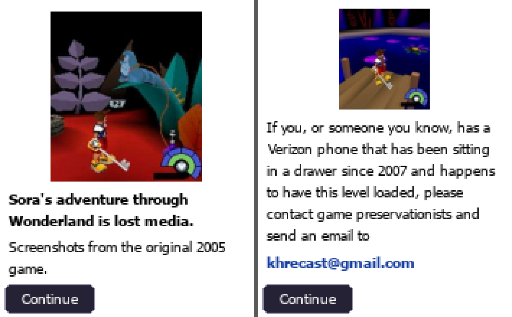

# Kingdom Hearts Re:Cast (khvcemu)

[](https://github.com/khrecast/khvcemu/actions/workflows/ci.yml)
[](LICENSE)

**An emulator for the 2005 Verizon V CAST *Kingdom Hearts* mobile game**
(Superscape / Disney Mobile, Qualcomm BREW), so a lost piece of Kingdom Hearts
history can be played again on a PC. The project is called *Kingdom Hearts
Re:Cast*; the code, package and command are `khvcemu`.

It runs the game's own `kh.mod` and Superscape's `swv21brew.mod` Swerve 3D
engine on an emulated ARM CPU and reimplements the BREW phone APIs they call in
Python. It boots the game, draws the real 3D, plays the music and sound
effects, and moves from world to world through the game's own chapter flow. The
lost Wonderland episode is bridged: after the Island the game shows its
surviving Wonderland journal and splash screen, then carries on to Agrabah.

**Playable on a PC, with full sound, for the first time.** Until now the game ran
only on its original phones, on a collector's modified Zeebo console, or without
any audio in an Android emulator. As far as we know, khvcemu is the first
emulator to play it with its music and sound effects in context.

> **Please read.** Kingdom Hearts and all related characters, names and assets belong to their respective rights holders. This is an unofficial fan project and is not affiliated with, endorsed by or connected to Disney, Square Enix, Superscape, Verizon, Qualcomm or any other rights holder. It exists only to preserve, and let people experience, a piece of gaming history. It is free and non-profit: nobody earns money from it, and it should never be sold.

> **How this was made.** Re:Cast was written with the assistance of AI coding tools. The project exists because its
> author wanted to play this game, with its sound, on a PC, and building an emulator with AI help was the only way they
> found to do it. It has been tested by playing the game and by an automated test suite, and all the code is open
> (GPL-3.0) for anyone to read. Some people object to AI use of any type, and that is a fair position: this note is here
> so you can decide with the facts.




## Features

**Authentic**

* **The game's own code, unchanged.** khvcemu runs the real `kh.mod` and
  Superscape's Swerve 3D engine on an emulated ARM CPU, so what you see is the
  game itself, not a remake: its 3D, its scripts, its chapter flow, its menus.
* **The original music and sound effects**, in step with gameplay (the sound
  effects are the phone's QCELP audio, decoded for you).
* **The game's own saves and scores.** Load Game, save points and the
  "post your score and get a ranking" screen all work as they did on the phone.
* Plays the surviving chapters (chapter 1 with its training area and Swashbuckler's Island, Agrabah and Maleficent's Castle).
  The lost **Wonderland** episode is bridged with the game's own surviving
  screens rather than anything invented.

**Quality of life**

* **Save states** at any moment (F5 / F9, nine slots, autosave), on top of the
  game's own save points, with automatic backups of the game's saves.
* A **launcher** with a **Continue** button and a preview of where you left off,
  one-click install of what's missing, and your settings remembered.
* **Picture filters** (crisp pixels, smooth, sharp pixels, Scale2x; F11 cycles
  them) and **smooth hi-res text**, redrawn sharply at your window's resolution. The game
  was built for tiny flip-phone screens (176×220), so it naturally looks best when the
  window is small; the filters are there for when you want it bigger.
* **High scores that work again.** The original ranking server is long gone, so
  khvcemu answers for it: scores are kept on your PC and, in the launcher, shared
  anonymously with a **shared leaderboard** so you can see how you rank.
* Keyboard controls (WASD or arrows) as well as the phone keypad, a resizable
  window and readable text.
* **Single-file installers** for Windows (64 and 32-bit), macOS and Linux with
  everything included (see [Installers](#installers-everything-included)).

## Game files

Kingdom Hearts and its assets belong to their owners. This **source repository
contains none of the game's files**; the `.gitignore` keeps a dump out of git.
There are two ways to get the game running:

* **The ready-to-run installers** (see [Installers](#installers-everything-included))
  are built from a preserved copy of the game and **do include its files**, so
  nothing else needs to be found or set up.
* **Running from source** needs a dump of the game: a folder holding `mif/` and
  `mod/` (the phone's BREW layout). Keep it outside the repository, or in it.

Where to find out about the game's files and their history:
[docs/PRESERVATION.md](docs/PRESERVATION.md).

## Installers (everything included)

Each build is **one file** that holds Python, the libraries, ffmpeg, khvcemu and the
game files (from this folder, or `--game <dump>`), so the person running it needs
nothing else. The outputs contain the game files, so `dist/` and `build/` are
git-ignored and are not part of the repo. Building needs internet access the first
time (Python, ffmpeg and the wheels are downloaded and cached in `build/`).

| Build | Command | Result |
| --- | --- | --- |
| Windows, 64-bit | `python tools/build_installer.py` | `dist/KH-ReCast-Windows-x64.exe` (~56 MB) |
| Windows, 32-bit | `python tools/build_installer.py --target win32` | `dist/KH-ReCast-Windows-x86.exe` (~43 MB) |
| macOS, Apple Silicon | `python tools/build_mac.py --arch arm64` | `dist/KH-ReCast-macOS-arm64.zip` (~81 MB) |
| macOS, Intel | `python tools/build_mac.py --arch x86_64` | `dist/KH-ReCast-macOS-x86_64.zip` (~86 MB) |
| Linux, x86-64 | `python tools/build_linux.py --arch x86_64` | `dist/KH-ReCast-Linux-x86_64.run` (~105 MB) |
| Linux, ARM64 | `python tools/build_linux.py --arch aarch64` | `dist/KH-ReCast-Linux-aarch64.run` (~93 MB) |

**Windows:** double-click the exe. It asks once, installs for the current user only (no
administrator rights), adds Start Menu and desktop shortcuts and an entry under
Settings > Apps, and offers to start the game. Saves and settings stay in your user
folder when you uninstall. Windows may show a SmartScreen warning because the file is
not code-signed (More info > Run anyway). Building needs Windows and 7-Zip. The 32-bit
build uses a community 32-bit ffmpeg (ffmpeg 6.0, from GitHub `sudo-nautilus/FFmpeg-Builds-Win32`).

**macOS:** unzip, drag "Kingdom Hearts Re-Cast" to Applications, and right-click > Open
the first time (the app is not signed by Apple). The zip is built on Windows without a
Mac: Python is python-build-standalone (with tkinter), the libraries are macOS wheels,
ffmpeg is a static build from osxexperts.net, and every compiled file is checked to be
for the right chip. **It has not been run on a Mac yet**, so report anything that fails.

**Linux:** run `sh KH-ReCast-Linux-x86_64.run` (or the `aarch64` one). It installs for your
user only (no root) under `~/.local/share/khvcemu`, adds "Kingdom Hearts Re:Cast" to the
applications menu, and removes itself with `--uninstall` (`--dir PATH`, `--yes` and
`--no-launch` are also understood). It needs a glibc 2.28 or newer desktop Linux (Ubuntu
20.04, Debian 10, Fedora 29 or later) with X11 or Wayland; Alpine and other musl systems are
not supported. Built like the Mac one (Python from python-build-standalone, manylinux wheels,
a static ffmpeg from johnvansickle.com, every compiled file checked for the right CPU). The
x86-64 installer was tested in clean Ubuntu 20.04 and Debian 10 containers (install, launcher
under a virtual display, game boot, sound decoding, upgrade, uninstall); the ARM64 one was
only run under emulation.

**Checking a download.** The installers are not code-signed, so compare the file's SHA-256
with the published `SHA256SUMS.txt` (also kept in this repository as `docs/SHA256SUMS.txt`, apart from the downloads): `sha256sum -c SHA256SUMS.txt` on Linux (`shasum -a 256 -c`
on macOS), or `Get-FileHash <file>` in PowerShell on Windows. `python tools/checksums.py`
writes that file after a build.

## Quick start

Most people should use an [installer](#installers-everything-included): one
download, nothing else to set up. To run from source instead, you need
**Python 3.10 or newer** and **ffmpeg** on your PATH (it decodes the
sound effects):

```
git clone https://github.com/khrecast/khvcemu.git
cd khvcemu
python -m pip install -r requirements.txt     # unicorn, pygame-ce, numpy
# ffmpeg:  winget install ffmpeg  |  brew install ffmpeg  |  apt install ffmpeg

python -m khvcemu path/to/your/dump           # run the game
python -m khvcemu.launcher                    # or use the launcher
```

You can also `pip install .` and use the `khvcemu` and `khvcemu-launcher`
commands. To open the launcher by double-clicking: **`Launch khvcemu.bat`** on
Windows, **`Launch khvcemu.command`** on macOS, **`launch-khvcemu.sh`** on Linux
(run it from a terminal, or mark it as runnable in your file manager).

## Get in touch

Questions, bug reports and preservation leads are welcome: open an
[issue](https://github.com/khrecast/khvcemu/issues) or email
**[khrecast@gmail.com](mailto:khrecast@gmail.com)**.

**Do you have a Verizon phone from the V CAST years (2005 to 2012) with *Kingdom Hearts* on it?** If
the Wonderland chapter is still installed, please don't reset it and email us:
see [Wonderland (lost media)](#wonderland-lost-media).

## Launcher (easiest)

Double-click **`Launch khvcemu.bat`** (Windows) or **`Launch khvcemu.command`**
(macOS), run `./launch-khvcemu.sh` (Linux), or run `python -m khvcemu.launcher`.
The launcher needs Python's tkinter: `brew install python-tk` on macOS with
Homebrew Python, `sudo apt install python3-tk` on Debian/Ubuntu (the installers
include everything). The launcher:

* is organized in tabs so the window stays short: **Play**, **Saves**, **Options**,
  **Sound**, **Setup** and **Controls**. It reopens on the tab you used last, and goes straight to
  **Setup** (marked "Setup (!)") when the game folder or a requirement is missing;
* **Play** shows a **Continue** card with a preview of your newest save, the world it is
  in and a big **Continue** button; **Play from the title screen** starts the
  game from the main menu (choose Load Game to continue your saved game);
* **Setup** finds the game folder (or lets you browse to it) and remembers it, and
  checks the requirements and installs the Python packages with one click
  (ffmpeg is listed with the command to install it). It also says whether the
  optional Wonderland theme is in the game folder (see below), and lets you play it,
  with a volume slider that the game uses too;
* **Saves** lists your save states with a thumbnail and date
  (double-click a slot to resume it; the list follows the game, so a state you save with F5
  appears within five seconds and the highlight moves to the newest save until you pick a
  row yourself) and lets you **Start at world**: Island,
  Agrabah or Castle, after warning you that it replaces your current save
  (which is backed up first);
* **Options**, in grouped boxes: **Window** (size, text size, picture filter, smooth hi-res text, a
  **dark screen** that blacks out the rest of the monitor behind the game); **While playing** (mute, whether the
  game pauses when you click away, whether Esc or the window's X asks before quitting, and three separate
  autosaves: every N minutes (the number is yours to type), when you quit, and at loading screens);
  **Screenshots (F12)** (the folder, chosen with the folder icon; a list of the pictures in it by the time they
  were taken, newest first; a preview of the one selected; and icons to open it or the folder; double-click opens one); **Online scores** (whether to share high scores, and
  where); and the 3D **speed-ups** (on by default, same picture). **Restore default
  settings** puts all of these back if one was changed by mistake (your saves, game
  folder and the Sound tab are not touched). "Auto" window size picks the largest
  that fits your desktop but never more than 2x, since the game looks best small;
  choose 3 or 4 for bigger;
* **Sound** tunes the built-in music synth with sliders: a volume for each
  family of instruments (piano, strings, brass, harp and guitar, bells, flutes,
  pads, bass, drums; "harp and guitar" also sets the bright, picked koto/banjo voice
  of Agrabah's rhythm part) and the music as a whole, plus piano hammer, piano tail,
  horn note length, bass cut and high-note softening. Pick a tune and press
  **Play** to hear it; while it plays, letting go of a slider plays the change. 100% everywhere is
  the sound as tuned (the **As tuned** mix, or double-click a percentage to reset one slider).
  **Mix** switches between ready-made mixes (As tuned, More bass, Bright and crisp, Big brass,
  Soft and warm, Quiet background) and your own: **Save as...** keeps the current sliders under a
  name, the star marks a favorite (favorites are listed first), **Delete** removes one of
  yours. **Choose...** a recording of the same tune (your own file, for example a
  restoration) to compare it with **Play recording**; **Its volume** sets how loud it plays and
  **Match** sets it to the built-in synth's level, or to a standard level if the tune renders
  quietly (done for you when you choose one). The button of whatever is playing is lit. Tick
  **Use the recording in the game** to hear your recording in the game instead of that tune's
  MIDI: it is cut or padded to the MIDI's length (a looping tune is cut where its music ends, so the next loop is never heard early),
  so the game's timing and looping are unchanged (a recording of the same MIDI that starts at
  the same moment should loop seamlessly), it is played at the game's 22.05 kHz mono, and its
  volume and Music volume apply (the synth sliders do not). The
  game uses all of this the next time it starts. **Advanced...** opens a window for a
  **SoundFont** (a bank of instrument samples, `.sf2`) to play the music through instead of
  the built-in synth, with an explanation of how to use one; it needs the free `fluidsynth`
  program, which the installers do not include. A SoundFont and a recording used in the game
  each replace the built-in synth, so while one is in use the sliders and mixes that no longer
  apply are grayed out (Music volume always applies, and a recording only grays them out for
  its own tune);
* shows the project's disclaimer at the top and a dark theme in the game's blues
  and greens.

It only needs Python 3.10+ (tkinter is included with the python.org installer).
The launcher waits while the game runs. Its save-state list and Continue card update
within five seconds of each save you make in the game, and straight away when you click
the launcher or bring it forward (the slot you picked stays selected);
if the game stops with an error it shows the last log lines.

## Run

Point it at the folder that holds `mif/` and `mod/` (the phone's BREW layout):

```
python -m khvcemu path/to/kh_dump
python -m khvcemu path/to/kh_dump --start agrabah     # then choose "Load Game"
```

`--start island|agrabah|castle` copies the dump's `savegame(<world>).dat` into
place as `savegame.dat`, so **Load Game** starts that world. **It replaces your
current save**, so only use it to jump to a world's start; to continue where you
left off, run without `--start` and choose **Load Game**. Your saves and
settings go to `~/.khvcemu/<dump folder name>/files/`. The dump itself is never
modified.

That folder is named after the game folder, so renaming or moving the game
folder would point khvcemu at an empty one. If it finds no saves there but
exactly one other save folder exists, it uses that one and says so; nothing is
moved or copied, so pointing the game folder back works as before. With several
save folders it won't guess: it names them and keeps to its own, and `--data
DIR` picks one.

**Save backups.** Before khvcemu overwrites or deletes `savegame.dat`,
`replaygame.dat` or `scoredata.dat` (the game saving again, or `--start`), it
copies the old file to `~/.khvcemu/<dump folder name>/save_backups/` as
`<name>.<date>-<time>.bak` (the newest 30 per file are kept). To restore one,
copy it over the file in `files/` as `savegame.dat` while khvcemu is closed.
`--start` also prints a warning when it replaces a save that has progress.
The game's own saves are small (stats, a progress code and the world name),
and it only writes them at save points and when a world ends, so Load Game
returns you to the last save point rather than the exact spot you left.

**High scores.** When a world ends, answer **Yes** to "post it to the server and
get a ranking?" and the Summary shows your rank. The original ranking server is
long gone, so khvcemu answers the game's `rank.php` and `rankex.php` requests
itself and keeps every posted score in
`~/.khvcemu/<dump folder name>/leaderboard.db` (a SQLite file on your PC).
Running `python -m khvcemu` directly sends nothing anywhere; the launcher also
shares scores unless you untick the box (see below). A rank is your place among all scores posted for that world, ties
sharing a place, so you can see how a run compares with your earlier ones; two
people sharing one data folder rank against each other. **Score** on the main
menu lists your best score per world, and **Update** there refreshes the ranks
(a world nobody has posted to yet shows no rank). Delete `leaderboard.db` to
start the table afresh.

**Clear times.** khvcemu times each world itself (the game's own time value is a running
clock, not a completion time). It counts the game's clock while a world is on screen, so
pausing, switching to another window, closing the window or loading a save state never adds or removes time, and the
Summary screen ends the run. Every world you finish, and every score the game posts, is appended to
`~/.khvcemu/<dump folder name>/clear_times.csv` with the time measured, and totals are kept
in `playtime.json` beside it. The measured time is also sent with a shared score, and
the shared leaderboard turns away runs under a minimum for the world (Island 6 minutes, Agrabah 10,
Castle 8).

**The shared leaderboard.** Scores can also be ranked against other people's.
The launcher's Options has **Share high scores with:**, **ticked by default** and
pre-filled with the project's server, `https://scores.khrecast.com` (a small Cloudflare
Worker, source in [`server/`](server/README.md)); untick it to stay fully offline. The address
can be edited to point at your own server, and leaving it empty means the default. From the command
line it is opt-in with `--leaderboard URL`, and you can run your own server. Your
scores are always kept offline too, and khvcemu falls back to them whenever the
server can't be reached. There are no accounts or names: only the world, score,
time and the Munny, EXP and level behind the score (read from the game's Summary screen) are
sent, and the game never shows another player's name, only a rank number. The project's
leaderboard page, `site/leaderboard.html`, shows the top 100 of each world with those
columns. The server uses a salted, shortened hash of the sender's address solely
to allow one score per address every ten minutes and deletes it after ten minutes (details in
[`server/README.md`](server/README.md)). Scores come from the player's machine,
so treat a shared rank as a rough comparison rather than a competitive ranking.

**Website counters.** The project website counts, anonymously and per day, how often its pages are
opened, which parts of the main page are scrolled to and which buttons are clicked (downloads per platform,
source and issue links), plus four separate tallies for each opening: the hour, the country (Cloudflare's coarse
location of the connection), the kind of computer (Windows, Mac, Linux, phone) and the website that linked to it
(its name only, from a short fixed list). No cookies, and the project's server keeps no address, browser string or
anything else about the visitor, only a day, a name and a number; the tallies are kept apart and never stored per visit, though on a very quiet day (a visit or two) the counts could still be matched up by eye. Browsers that send Do Not Track or Global Privacy Control are not counted
([details](server/README.md#website-counters)). Cloudflare, which hosts the site, keeps its usual server logs.
The emulator itself sends nothing to the website. `tools/show_site_stats.bat` (or `python tools/site_stats.py --open`)
shows the totals as a page in your browser.

Other options:

| Option | What it does |
| --- | --- |
| `--scale N` | Sets the window size as a multiple of the 176×220 screen. The game was built for tiny flip-phone screens (176×220), so it looks its best in a small window. By default it picks the largest that fits your desktop, up to 2 (use `--scale 3` or `4` for bigger). You can also drag the window edges or maximise it; the picture keeps its shape. |
| `--font-size N` | Sets the text size in phone pixels (default 11). Try 10 for smaller, 12 for bigger. |
| `--font NAME` | Picks the font for game text. The default is Verdana, else DejaVu Sans, Tahoma, Segoe UI or Arial. |
| `--filter MODE` | How the picture is enlarged to the window: `nearest` (crisp pixel blocks, the default), `smooth` (soft), `sharp` (crisp blocks of even width, edges softened only for the last fraction; best at odd window sizes) or `scale2x` (rounds off staircase edges without blurring). F11 cycles them in game; the launcher has the same choice under **Picture**. Only the picture: hi-res text is drawn on top either way, and F12 saves the raw frame. |
| `--hires-text` | Redraws the game's text sharply at your window's resolution. By default text is drawn at the phone's 176x220 and scales with the picture. (The launcher's **Smooth hi-res text** option.) |
| `--leaderboard URL` | Shares high scores with a leaderboard server (see [`server/`](server/README.md)). Off by default on the command line (the launcher turns it on for the project's server). Scores stay offline too; nothing identifying is sent. |
| `--no-autosave` | Turns off all autosave states (F8 toggles them in game). |
| `--autosave-every MINUTES` | Minutes of play between timed autosaves (default 5; `0` turns the timed ones off). The launcher's Options tab has the box. |
| `--no-autosave-on-quit` | No extra autosave when the window is closed mid-game. |
| `--no-autosave-on-loading` | No autosave a few seconds after each Loading screen. |
| `--dark-screen` | Blacks out the rest of the monitor the game window is on, behind the window (a black backdrop window; clicking it just brings the game back to the front, and minimising the game removes it). The launcher's Options tab has a checkbox for it. |
| `--screenshots DIR` | Where F12 saves screenshots (made if missing). Default: a `khvcemu` folder inside your Pictures folder, or the current folder if there is no Pictures folder. The game shows "Saved: ..." at the top of the window when one is taken; the launcher's Options tab has the folder setting. |
| `--no-quit-prompt` | Quits at once on Esc or the window's X, without the "Quit the game?" question (autosave on exit still happens). In the question, **D** quits and turns it off for good (it is saved in the launcher's settings, which the game reads itself, so it also holds for games started from the command line). The launcher's Options tab has a checkbox: "Ask before quitting". |
| `--no-speed-patch[=NAMES]` | Turns off the 3D engine speed-ups (see [Speed](#known-issues--limitations)); the picture is the same either way. Alone (after the game folder) or `=all` turns off all of them, or give a comma separated list, written with an equals sign, of `span` (the pixel fill), `matinv` (the matrix cache) and `float` (a floating point shortcut). The Options tab has a checkbox for each. For troubleshooting. |
| `--no-focus-pause` | Keeps the game running when its window loses focus (by default it pauses, dims the picture and shows "PAUSED - Click the window to continue", and time away is not counted as play time). The launcher's Options tab has a checkbox for it. |
| `--load-state SLOT` | Resumes a save state: `1`–`9`, `auto` (newest autosave), `auto2` or `auto3`. |
| `--mute` | Turns off audio output. |
| `--soundfont FILE.sf2` | Renders MIDI music with fluidsynth and a General MIDI SoundFont, for real instrument samples instead of the built-in synth (which is tuned, and adjustable under the launcher's **Sound** tab). Needs the `fluidsynth` program on your PATH; the installers do not include it. |
| `--wonderland-volume X` | Volume of the Wonderland theme on the Wonderland screen, 0 to 2 (default 1). The launcher's Setup tab has a Play button and a Volume slider for it and passes this on. |
| `--music-file NAME=PATH` | Plays your own recording of a tune instead of the game's MIDI, for example `--music-file "training.mid=C:/music/title.flac"` (repeat for more tunes; needs ffmpeg). It is cut or padded to the MIDI's own length (a looping tune is cut where its music ends), so the game's timing is unchanged; a missing file falls back to the MIDI. Nothing is bundled. `--music-file-volume NAME=GAIN` sets its volume (1 = as recorded, up to 4). The launcher's Sound tab writes both. |
| `--music SETTINGS` | Adjusts the built-in music synth, for example `--music "piano=0.8,bass_cut=1.5"` (1 = as tuned). This is what the launcher's Sound tab passes; `--help` lists the names. With a SoundFont only `master` (the music volume) applies. |
| `--keep-wonderland` | Turns off the Wonderland stand-in (see below); only useful with a real Wonderland dump. |
| `--data DIR` | Sets where saves go. |
| `-v` | Logs BREW activity. |

### Controls (phone keypad)

| Keyboard | Phone key | In game |
| --- | --- | --- |
| Arrow keys, WASD, or 2 4 6 8 | Up/Down/Left/Right | Up = walk forward (tank controls) |
| Enter / Space / 5 | Select | Menu select, action, attack, jump |
| F1 or Q | Left softkey | Continue; pause in game |
| F2 or E | Right softkey | Back / Options |
| Z, or 0 (row or numpad) | 0 | **Status**: health, magic and stats. **Next** (F1 or Q) lists your items, potions and munny. In the pause box this quits instead. |
| 1–9 (row or numpad) | Number keys | |
| F, `[` or numpad `*` | `*` | Cast magic |
| `]` / numpad `/` | `#` | |
| Backspace | CLR | |
| F10 / F12 / Esc | | Mute / screenshot (says where it was saved) / quit (F10 flashes a speaker in the corner, crossed out when muted; Esc asks "Quit the game?" first: Enter or Y quits, Esc or N resumes, D quits and never asks again; the launcher's Options tab and `--no-quit-prompt` turn the question off) |
| F11 | | Picture filter: crisp pixels, smooth, sharp pixels, Scale2x (cycles) |
| F5 / F9 | | Save state / load state (current slot) |
| F6 / F7 (or Shift+1–9, Shift+0) | | Previous / next save-state slot; slot 0 = the newest autosave |
| F8 | | Autosave on / off |

Z is an alias for the phone's `0` key, so it follows whatever that key is bound
to on the game's own **Controls** screen (pause, **Options**, **Controls**).
The launcher's **Controls** tab and the website show the main keys from this table.

### Save states

Save states snapshot the whole emulator at any moment, unlike the game's own
saves, which only happen at save points.

* **F5** saves to the current slot (slot 1 at start) and **F9** loads it.
  **F6 / F7** step to the previous / next slot (1–9, then 0 = the autosave);
  **Shift+1–9** jumps straight to a slot. A message at the top of the window
  shows the slot and whether it's empty. The plain number keys are still
  phone keys.
* Autosave can be turned off with **F8** in game (it says which kinds are on), `--no-autosave`, or the
  launcher's checkboxes: the three kinds can be switched separately.
* **Autosave:** khvcemu writes one every 5 minutes of play (or the number you set; saving by hand does not restart that
  timer), a few seconds after each "Loading..." screen when you enter a new area (not within 30
  seconds of the last autosave), and when you quit mid-game (Esc or the window's close button). A
  small floppy disc shows in the bottom-left corner when one is written, so it never covers the
  dialogue. It skips this if no game key was pressed since the last save or load, so sitting on the
  title screen never pushes real autosaves out. The newest three are kept as
  `auto1`–`auto3`; **Shift+0** then **F9** loads the newest.
* **At startup:** `python -m khvcemu <dump> --load-state 3` (or `auto`,
  `auto2`, `auto3`) resumes straight into a state.
* **Rendered music:** the built-in synth's renderings of the game's tunes are made in the background as the game
  starts and kept in `~/.khvcemu/<dump folder name>/audio_cache/` (about 3.5 MB), so a tune does not have to be
  built, and the game does not pause, the first time it plays. It rebuilds itself when a tune, the Sound tab
  settings or the synth change; you can delete the folder at any time.
* States are stored in `~/.khvcemu/<dump folder name>/states/` as
  `slotN.khs` / `autoN.khs` (under 1 MB each) with a `.png` thumbnail.
* Loading a state never touches the game's own save files on disk.
* A state only loads with the same game files and settings
  (`--keep-wonderland`, screen size) it was made with; anything else is
  refused without changing the running game.
* States are Python pickles: only load your own, never one from someone else.

## How chapters work (and what the emulator does about them)

What the game code and data show:

* **The save file names the current world.** `savegame.dat` stores Sora's stats
  plus the current world's name (`island`, `wonderland`, `agrabah`, `castle`).
* **A script line ends each world.** Scene scripts are plain text inside the
  `.m3g` files, and each world's last scene ends with `summary <next world>`.
  Examples: `training_part2.m3g` → `summary island`, `island_exit.m3g` →
  `summary wonderland`, `agrabah_outro.m3g` → `summary castle`. That line shows
  the Summary screen, autosaves, then shows the next world's splash.
* **The splash checks whether the episode is installed.** It tests
  `<world>.m3g` with `IFILE_Read(NULL, 0)`, which returns the bytes left in
  the file. If the file is there you get **Continue**; if not you get
  **Download**, which fetches `http://swervenet.superscape.com/disney/download.php?f=<world>.dat`
  over IWeb. Before downloading, the game deletes every other world's files,
  because phones held one episode at a time.
* **This dump has several worlds merged into one folder.** Training, Island,
  Agrabah and Castle are all present, so every world except Wonderland is
  installed at once.

What khvcemu does:

1. **Implements `IFILE_Read(NULL, …)` correctly.** Without this, every world
   asks to be downloaded.
2. **Protects dump files from deletion.** A delete of a file from the dump is
   ignored, so a download attempt can't wipe the other worlds.
3. **Bridges the lost Wonderland episode.** The Island's real ending
   (`summary wonderland`) is left alone, so the game shows the Wonderland
   journal text and splash screen that survive in the dump. The episode's
   world file, `wonderland.m3g`, is lost, so khvcemu supplies a stand-in (built
   in memory from `training.m3g`) whose only script line is `summary agrabah`.
   **Continue** on the Wonderland splash therefore leads to a second Summary
   (what you'd see after finishing Wonderland; it shows the same stats), then
   Agrabah's journal, splash and level. If a Wonderland theme is present
   (see [Wonderland](#wonderland-lost-media)) it plays on the Wonderland splash.
   Before that Continue goes through, khvcemu shows two pages of its own (the
   screenshots and the lost-media message, `lostmedia.py`).

The Download screen can't reach the dead episode server and shows the game's own
"network is not available" message. (High scores are handled offline; see
[Run](#run).)

## What was verified

These were checked headless on your dump; `tests/test_game.py` automates them:

* **Boot and title screen.** Boots to the title menu with the title music.
* **All three saves.** Load Game on each of the Island, Agrabah and Castle
  saves reaches that world's scenes with no emulation faults.
* **World-end transition.** A test copy of the training script ends the world
  with `summary wonderland` right away. The game shows Summary, autosaves, shows
  the Agrabah journal and splash, and Continue loads Agrabah
  ([screens](docs/wonderland_reroute.png)). The rewritten save names Agrabah.
* **Audio.** Music (MIDI) and sound effects (CMX `.pmd`) play in step with
  gameplay.
* **Island ending to Agrabah.** The Island's real ending scene plays through:
  high-score prompt, Summary (autosave), the Wonderland journal and splash
  (with the Wonderland theme), then the second Summary, Agrabah's journal and
  splash, and the Agrabah level. The save names Agrabah afterwards.
* **High scores.** The first score of that run is posted, lands in
  `leaderboard.db`, and the Summary shows its rank; the Score screen's Update
  refreshes the ranks.

* **Full human playthrough.** A person has played the whole game by hand in the
  emulator, from the tutorial through the Island, Agrabah and the Castle to the
  end. The transition from the Island to Agrabah (the rerouted Wonderland skip)
  worked flawlessly.

## Known issues / limitations

* **Speed.** It's Python plus Unicorn, and the 3D engine executes about 5
  million ARM instructions per frame. The game asks for 25 fps; 3D scenes ran
  at about real-time speed on the machine this was built on, so slower PCs
  will get fewer frames. The game reads the clock each frame, so it should
  mostly drop frames rather than slow down. Two things dominate: the per-pixel
  fill of a polygon row (about half of the instructions in some scenes), and a
  4x4 matrix inversion the 3D engine repeats hundreds of times a frame on a few
  hundred different matrices. Re:Cast speeds these up in memory (never in the
  game files), only when the module is byte for byte the known one: a tighter
  fill loop, and a cache of the inversion's answers (the key is all 17 input
  words, so a hit is exactly what the original would have computed); a third,
  small one answers the engine's half a million soft-float reverse subtractions a
  second, most of them with a zero operand. The picture
  is identical (checked frame by frame; see `khvcemu/swerve_patch.py`). Each can
  be turned off in the Options tab or with `--no-speed-patch`. On the machine
  this was built on, the Island's opening scene went from about 21 to about 25
  frames per second and a walking scene from about 21 to about 23.
* **Font.** The game asks for a custom font class (`0x0100a004`) that no
  firmware file provides, so text uses a host font (Verdana by default, drawn
  without smoothing). It's readable, but the shapes aren't the phone's; use
  `--font-size` / `--font` to adjust.
* **Music.** The built-in MIDI synth is an approximation of the phone's. Its
  piano, horns and strings were tuned against SoundFont renders of the Title and
  Island tunes; the launcher's Sound tab adjusts it further, and `--soundfont`
  swaps in proper General MIDI instruments.
* **Inferred ABI details.** A few details were inferred from the game's own
  calls rather than from Qualcomm headers:
  * IGraphics slots beyond those zeebulator verified.
  * Raster op 7: KH calls `FillRect(viewport, 0, 7)` after every 3D frame;
    it's implemented as a mask, a no-op for color 0.

  Anything the game calls that isn't implemented is logged as `[unimpl]` with
  its interface, slot and arguments.
* **macOS builds are untested on a real Mac.** They are built and checked to
  contain the right files for each chip, but nobody has run them yet; please
  report what breaks. The Windows and Linux installers were tested.
* **Wonderland (chapter 2) is lost media.** See
  [Wonderland](#wonderland-lost-media). If a dump ever turns up, drop its files
  in and use `--keep-wonderland`.

## Wonderland (lost media)

Chapter 2, *Alice in Wonderland*, was a separate download on the phones, and no
copy of its game files is known to survive. All that is left is what the other
chapters carry: Jiminy's journal entry, the splash image and a few
screenshots from the time. khvcemu shows the journal and splash where the game
always showed them, between the Island and Agrabah:



Screenshots of the lost level (from 2005-era coverage) and its splash art:





**In the emulator.** After the Alice in Wonderland splash, pressing Continue
shows two khvcemu-drawn pages in the game's own style: the caterpillar screenshot
with "Sora's adventure through Wonderland is lost media", then the pond
screenshot with the message below and the contact address (khrecast@gmail.com).
Continue on each page moves on; the game is frozen meanwhile and gets its
Continue press after the second page.



**Music.** The Wonderland theme isn't in the dump. If you have it, put it in
the dump folder as `wonderland/Wonderland.flac` (or `wonderland.mid`, `.ogg`,
`.wav`, `.mp3`; a MIDI file is closest to the phone, FLAC is the best of the
audio formats because it loops without a gap). It then plays on the Wonderland
splash screen. The installers include it (Aid1043's rendering of the Wonderland track, from their [KHInsider album](https://downloads.khinsider.com/game-soundtracks/album/kingdom-hearts-v-cast-mobile-gamerip-2005)); a copy of this repository does not, and the
launcher's **Setup** tab says whether it was found.

**Do you have a phone from this era?** The phones held one chapter at a time,
and starting a new chapter deleted the old one. If someone stopped playing
while the Wonderland chapter was installed, that phone may still hold the only
copy of it. If you have, or know of, a Verizon phone from the V CAST years (2005 to 2012) with
*Kingdom Hearts* on it, please don't reset it: contact a game preservation
group (for example the Lost Media Wiki or a BREW preservation community) so
the files can be dumped safely. The game launched on the LG VX8000, Samsung SCH-a890
and UTStarcom CDM8940, and the LG VX8100 and VX8300 have the same 176x220 screen, so
look for those first; any Verizon phone of the time is a candidate.

## How it works

```
khvcemu/
  cpu.py        Unicorn ARM926 core (User mode), trap page for host calls, re-entrant guest calls
  runtime.py    module loading (ROPI static-base word), extension modules, shell loop, timers, events
  helpers.py    AEEHelperFuncs (BREW stdlib table, 117 slots)
  shell.py      IShell (class factory, timers, events, resources, prefs, media handlers)
  display.py    IDisplay, IBitmap/IDIB (RGB565), raster ops, text
  graphics.py   IGraphics (UI polygons, dialog boxes)
  image.py      IImage (BMP/PNG via pygame)
  files.py      IFileMgr/IFile + VFS (dump read-only, writes to an overlay)
  media.py      IMedia -> audio.py (mixer), midi_synth.py (built-in synth), pmd.py (CMX/QCELP)
  web.py        IWeb/IWebResp/ISource: the game's HTTP calls;  leaderboard.py  offline score table behind them
  (server/)     optional shared leaderboard: a Cloudflare Worker answering the same two requests
  resfile.py    .bar/.mif resource files;  m3g.py  M3G section reader/writer (script patching)
  chapters.py   save seeding, Wonderland stand-in world + theme
  savestate.py  save states: memory pages + HLE objects + trap table, slots and autosaves
  swerve_patch.py  speed-ups for the 3D engine: a faster pixel-fill loop, a matrix inversion cache and a float shortcut (same picture; machine code made by tools/gen_swerve_patch.py)
  frontend.py   pygame window, keys, picture filters, real-time loop;  __main__.py  CLI
  launcher.py   the tkinter launcher;  paths.py  per-user folders, icons, bundled tools
```

A few details that took some digging:

* **BREW modules are flat, position-independent ARM images.** `AEEMod_Load`
  is the first instruction, and the stdlib table is found through a pointer
  stored 4 bytes before the load address.
* **Swerve checks the CPU mode.** It only touches the MMU (CP15) if it thinks
  it's privileged, so guest code runs in User mode.
* **`.pmd` sound effects are QCELP speech-codec audio.** They're CMX files
  whose wave blocks hold QCELP-13K packets: a 7-byte header, then 35-byte
  full-rate frames. The emulator wraps them in a QCP container and decodes with
  ffmpeg.

### Tests and dev tools

```
python -m unittest tests.test_units tests.test_music_settings tests.test_music_mixes   # no game files needed
KH_DUMP=path/to/kh_dump python -m unittest tests.test_game  # end-to-end, ~4 min
python tools/probe.py <dump> --ms 12000 -v                  # headless run, logs + last frame
python tools/frames.py <dump> out/ --save castle --keys 11000:DOWN,12000:SELECT,15000:SOFT1
python tools/make_tab_labels.py [KHMenu.otf]                # redraw the launcher's tab names (font not included)
python tools/launcher_screenshots.py                        # Windows: retake the launcher screenshots for the website
python tools/disasm.py <mod> 0x100000 <addr> [n]            # needs capstone
python tools/profile_guest.py --root <dump> world           # which ARM blocks the 3D scene runs most in
python tools/gen_swerve_patch.py                            # rebuild the speed-ups' machine code (needs keystone-engine)
python tools/xrefs.py  <mod> 0x100000 savegame summary      # string cross-references
python tools/build_installer.py | build_mac.py | build_linux.py   # installers, see above
python tools/make_icon.py                                   # redraws the window icon
```


## Credits and license

* **zeebulator (GPL-3.0).** The BREW interface layouts (IShell, IDisplay,
  IBitmap, IFile/IFileMgr, IMedia, the AEEHelperFuncs table) and the
  `.mif`/`.bar` resource measurements come from zeebulator, an open-source
  Zeebo/BREW emulator. So khvcemu is GPL-3.0 too (see `LICENSE`).
* *Kingdom Hearts*, Disney, Superscape and
  Swerve are their owners' trademarks. This emulator is designed to work with
  game files from preserved copies, following the established precedent of
  digital archivists and video game preservation organizations: lost media may
  be preserved and shared when the original rights holders have abandoned active
  distribution (the 2005 BREW version has not been commercially available for
  20 years and its distribution platform is defunct).
* **Non-commercial preservation project.** This is an unprofitable educational
  and preservation effort. No revenue is generated from this code or any
  recovered game files. This project is not affiliated with, endorsed by, or
  authorized by Disney, Qualcomm, Superscape, or any rights holders. It exists
  solely to preserve, study, and appreciate a lost piece of gaming history.

## Thanks

This project stands on years of work by people who found, dumped, restored,
recorded and wrote about the game. The full list, with links, is in
**[docs/CREDITS.md](docs/CREDITS.md)**. In brief:

* **Recovering the files:** "Wedge" (chapter 1, 2016, via
  [KH13](https://www.kh13.com/news/kingdom-hearts-v-cast-code-released-including-various-screenshots-audio-files-more/)
  and the [Internet Archive](https://archive.org/details/KingdomHeartsVCastChapter1)),
  "Cbajd5" (Agrabah, 2018) and "Eriyu" and "kraze1984" (Maleficent's Castle, 2022),
  as recorded by the [Lost Media Wiki](https://lostmediawiki.com/Kingdom_Hearts:_V_Cast_(partially_lost_mobile_game;_2005))
  and [KHwiki](https://www.khwiki.com/Kingdom_Hearts_V_CAST).
* **The music:** composer [Ian Livingstone](https://en.wikipedia.org/wiki/Ian_Livingstone_(composer));
  [13th Vessel](https://www.youtube.com/@13thVessel) and [Aid1043](https://www.youtube.com/@Aid1043)
  for recovering and restoring the soundtrack; also
  [Spoofer's Domain](https://www.youtube.com/@spoofersdomain9185) and
  [cantbehelped](https://www.youtube.com/@cantbehelped).
* **Playing and recording it:** [KrZ One](https://www.youtube.com/@krzbrew) (on real Zeebo
  hardware), [Negative Space](https://www.youtube.com/@negativespace7868) (the Castle on a
  real phone), [Zero-Up](https://www.youtube.com/@michaelkindt3288) and
  [TheGamersJoint](https://www.youtube.com/@TheGamersJoint).
* **Look and feel:** [Televo](https://github.com/Televo/kingdom-hearts-recollection) recreated the Kingdom
  Hearts menu font (KHMenu) that the Re:Cast title and the launcher's tab names are drawn in.
* **Emulation research:** [zeebulator](https://github.com/requeijaum/zeebulator), whose BREW
  interface research this project builds on, and
  [Melange](https://gitlab.com/usernameak/brewemulator) by UsernameAK, the Android BREW
  emulator that can run the game without audio.

## License

khvcemu is free software under the **GNU General Public License v3.0**; see
[LICENSE](LICENSE). The game files it runs are not part of this project and are
not covered by that license.

Contact: **khrecast@gmail.com**
